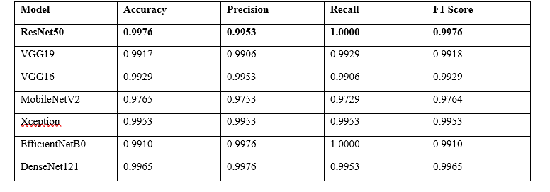

<br>


  

<h1 align="center">Canine Femur Fracture Classification</h1>

  

<p align="center">

  An AI-powered system to accurately classify canine femur fractures from X-ray images into <strong>Oblique</strong> and <strong>Overriding</strong> categories using state-of-the-art Deep Learning models.

  <br>

  <br>

  <a href="#-key-features">Key Features</a> •

  <a href="#-project-pipeline">Pipeline</a> •

  <a href="#-results">Results</a> •

  <a href="#-getting-started">Getting Started</a> •

  <a href="#-usage">Usage</a> •

  <a href="#-acknowledgments">Acknowledgments</a>

</p>

  

<p align="center">

  

  

  

</p>

  

---

  

## 📖 About The Project

  

This project provides a complete, end-to-end solution for the automated classification of dog femur fractures. By leveraging computer vision and deep learning, it aims to assist veterinary professionals in diagnosing fracture types from X-ray images with high accuracy. The system processes raw radiographs, isolates the femur, and uses a suite of powerful Convolutional Neural Networks (CNNs) to deliver a fast and reliable classification.

  

This repository contains all the necessary code, from data preprocessing and model training to a ready-to-use desktop application for real-time predictions.

  

---

  

## ✨ Key Features

  

*   **🦴 Automated Femur Segmentation:** Removes yellow squares to isolate the femur bone.

*   **🔄 Data Augmentation & Balancing:** Robustly increases dataset diversity and prevents class imbalance for better model generalization.

*   **🧠 Multiple CNN Architectures:** Implements and compares several renowned models:

    *   VGG16 / VGG19

    *   ResNet50

    *   MobileNetV2

    *   Xception

    *   EfficientNetB0

    *   DenseNet121

*   **🚀 High Performance:** Achieves over 99% accuracy, precision, and recall in classifying fractures.

*   **🖥️ Desktop GUI:** An intuitive graphical user interface for easy, real-time classification without needing to code.

  

---

  

## ⚙️ Project Pipeline

  

The project follows a systematic pipeline to ensure robust and reproducible results.

  

**Raw X-ray → Segmentation → Augmentation → Balancing → Model Training → Prediction**

  

1.  **Data Preprocessing & Segmentation (`01-Segmentation/`)**

    The initial step processes raw X-ray images. A segmentation algorithm is applied to automatically detect and crop the region of interest (the femur bone), reducing noise and focusing the models on relevant features.

  

2.  **Data Augmentation (`02-Augmentation/`)**

    To create a more robust training set and prevent overfitting, various data augmentation techniques (e.g., rotation, flipping, zooming) are applied to the segmented images.

  

3.  **Data Balancing (`03-Data-Balancing/`)**

    The dataset is carefully balanced to ensure an equal number of samples for both the "Oblique" and "Overriding" fracture classes. This is critical for training an unbiased model.

  

4.  **Model Training & Evaluation (`04-Modeling/`)**

    This core stage involves training multiple CNN architectures using both feature extraction and fine-tuning methods. Each model's performance is rigorously evaluated using standard classification metrics.

  

---

  

## 📊 Results

  

The trained models demonstrated exceptional performance on the validation set. The fine-tuned **ResNet50** model emerged as the top performer.

  



  

*All trained models are available in the `05-Saved-Models/` directory.*

  

---

  

## 🗂️ Project Structure

  

```

.

├── 00-The-DataSet/

│   ├── 00-Dogs-Femur-Fracture/     # Raw X-ray images

│   ├── Augmented_DataSet/          # Output of the augmentation script

│   ├── Balanced_DataSet/           # Output of the balancing script

│   └── Dataset_split/              # Final train/validation/test split

├── 01-Segmentation/                # Scripts for femur segmentation

├── 02-Augmentation/                # Scripts for data augmentation

├── 03-Data-Balancing/              # Scripts for balancing classes

├── 04-Modeling/                    # Jupyter notebooks for model training

├── 05-Saved-Models/                # Trained models in .h5 format

├── Desktop-Application/            # Source code for the GUI application

├── requirements.txt                # Project dependencies

└── README.md                       # This file

```

  

---

  

## 🚀 Getting Started

  

To get a local copy up and running, follow these simple steps.

  

### Prerequisites

  

*   Python 3.10+

*   Git

  

### Installation

  

1.  **Clone the repository:**

    ```sh

    git clone https://github.com/ahmedxxzz/The-Graduation-Project

    ```

  

2.  **Create and activate a virtual environment (recommended):**

    ```sh

      # For macOS/Linux

      python3 -m venv venv

      source venv/bin/activate

    ```

    # For Windows

```sh

python -m venv venv

venv\Scripts\activate

```

  

3.  **Install the required packages:**

```sh

pip install -r requirements.txt

```

  

---

  

## ▶️ Usage

  

You can use the trained models in two ways: through the desktop application or by integrating the model into your own Python scripts.

  

### 1. Desktop Application

  

The easiest way to perform a classification is with the provided GUI.

  

1.  Navigate to the application directory:

```sh

    cd Desktop-Application/

```

2.  Run the application:

```sh

    python main.py  # or the relevant main script name

```

3.  Click the "Upload Image" button, select a canine X-ray, and the model will predict the fracture type.

  
  

---

  

## 🎓 Acknowledgments

  

This work was developed as a graduation project for the Faculty of Computers Science and Artificial Intelligence at the **University of Sadat City**. We extend our gratitude to our supervisors and the university for their support.